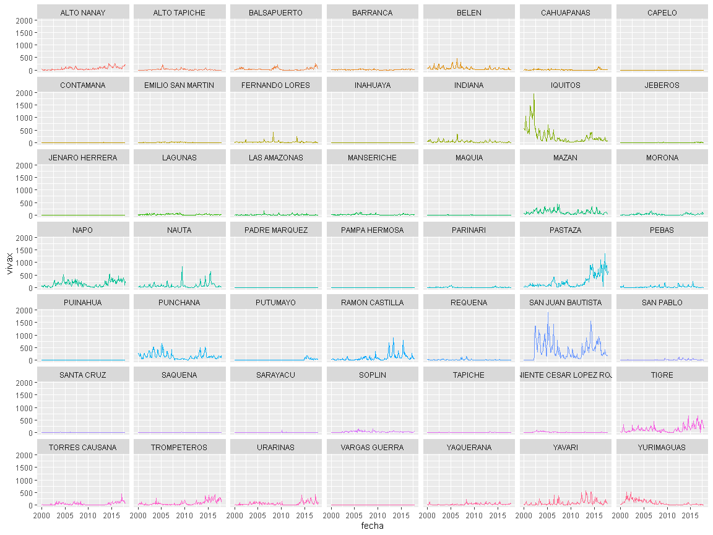

Rolling
================

| NOMBDIST   | year | month | falciparum | vivax |      aet |     prcp |         q |    soilm |     tmax |     tmin | water\_deficit | loss | loss\_km2 | cum\_loss\_km2 | diag | enviro | nets | workers | pamafro | pop2015 | NOMBPROV | NOMBDEP | IDDIST |
| :--------- | ---: | ----: | ---------: | ----: | -------: | -------: | --------: | -------: | -------: | -------: | -------------: | ---: | --------: | -------------: | ---: | -----: | ---: | ------: | ------: | ------: | :------- | :------ | -----: |
| ALTO NANAY | 2000 |     1 |          2 |    42 | 90.77845 | 227.1915 | 136.41657 | 35.93226 | 31.02560 | 21.68437 |              0 |    0 |         0 |              0 |    0 |      0 |    0 |       0 |       0 |    2784 | MAYNAS   | LORETO  | 160102 |
| ALTO NANAY | 2000 |     2 |          2 |    40 | 82.10381 | 277.7218 | 195.61598 | 35.93226 | 30.95167 | 21.54720 |              0 |    0 |         0 |              0 |    0 |      0 |    0 |       0 |       0 |    2784 | MAYNAS   | LORETO  | 160102 |
| ALTO NANAY | 2000 |     3 |          2 |    21 | 66.84633 | 357.9927 | 291.14619 | 35.93226 | 30.35163 | 21.34556 |              0 |    0 |         0 |              0 |    0 |      0 |    0 |       0 |       0 |    2784 | MAYNAS   | LORETO  | 160102 |
| ALTO NANAY | 2000 |     4 |          0 |     3 | 61.77111 | 333.7619 | 271.99120 | 35.93226 | 30.04192 | 20.77848 |              0 |    0 |         0 |              0 |    0 |      0 |    0 |       0 |       0 |    2784 | MAYNAS   | LORETO  | 160102 |
| ALTO NANAY | 2000 |     5 |          3 |    15 | 70.01232 | 379.5490 | 309.53255 | 35.93226 | 29.96529 | 21.32012 |              0 |    0 |         0 |              0 |    0 |      0 |    0 |       0 |       0 |    2784 | MAYNAS   | LORETO  | 160102 |
| ALTO NANAY | 2000 |     6 |          1 |     0 | 67.14399 | 163.2931 |  96.14824 | 35.93226 | 30.18416 | 21.13831 |              0 |    0 |         0 |              0 |    0 |      0 |    0 |       0 |       0 |    2784 | MAYNAS   | LORETO  | 160102 |

<!-- -->

<!-- -->
