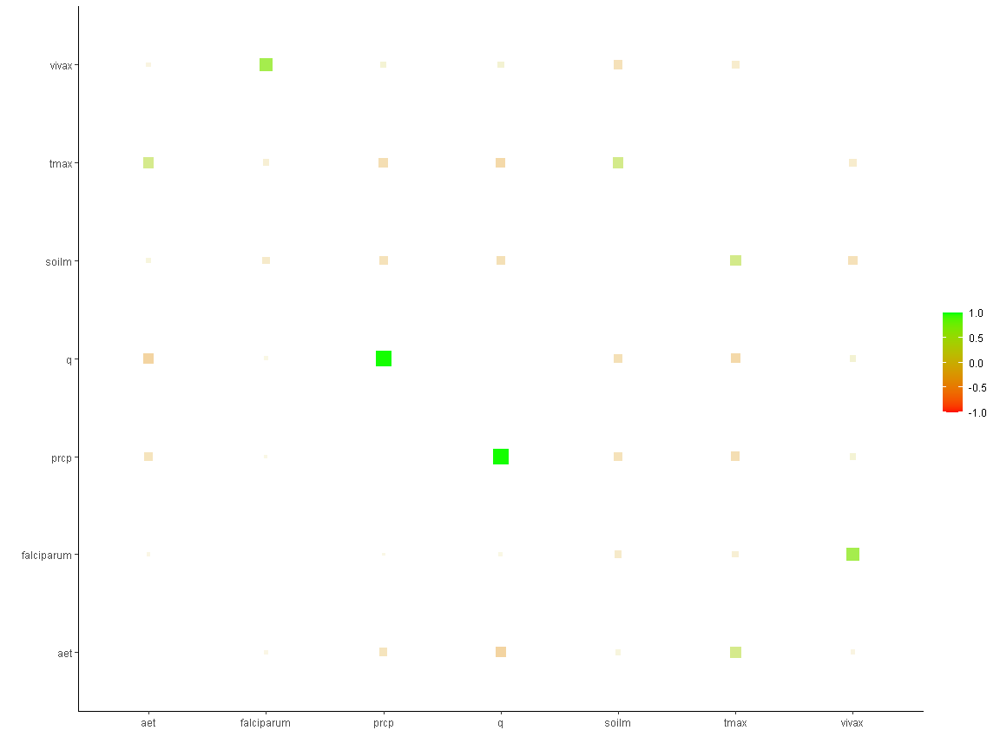
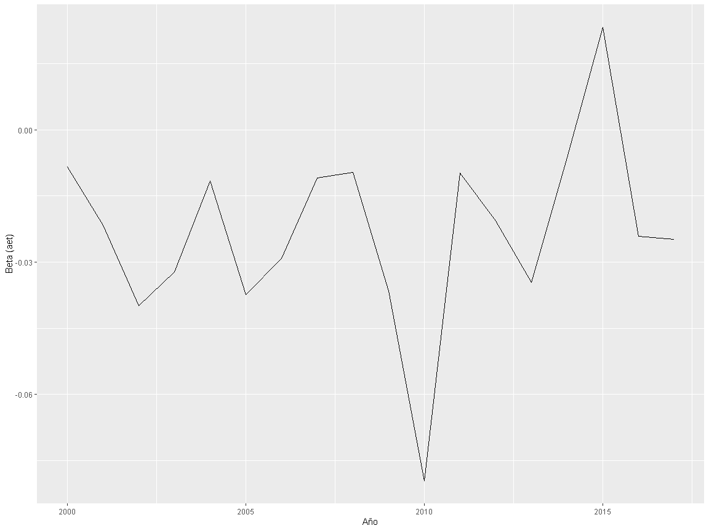

Rolling
================

### Carga de datos

``` r
dt_final<-read.csv("./_data/dt_final.csv")
head(dt_final)
```

<div class="kable-table">

| NOMBDIST   | year | month | falciparum | vivax |      aet |     prcp |         q |    soilm |     tmax |     tmin | water\_deficit | loss | loss\_km2 | cum\_loss\_km2 | diag | enviro | nets | workers | pamafro | pop2015 | NOMBPROV | NOMBDEP | IDDIST |
| :--------- | ---: | ----: | ---------: | ----: | -------: | -------: | --------: | -------: | -------: | -------: | -------------: | ---: | --------: | -------------: | ---: | -----: | ---: | ------: | ------: | ------: | :------- | :------ | -----: |
| ALTO NANAY | 2000 |     1 |          2 |    42 | 90.77845 | 227.1915 | 136.41657 | 35.93226 | 31.02560 | 21.68437 |              0 |    0 |         0 |              0 |    0 |      0 |    0 |       0 |       0 |    2784 | MAYNAS   | LORETO  | 160102 |
| ALTO NANAY | 2000 |     2 |          2 |    40 | 82.10381 | 277.7218 | 195.61598 | 35.93226 | 30.95167 | 21.54720 |              0 |    0 |         0 |              0 |    0 |      0 |    0 |       0 |       0 |    2784 | MAYNAS   | LORETO  | 160102 |
| ALTO NANAY | 2000 |     3 |          2 |    21 | 66.84633 | 357.9927 | 291.14619 | 35.93226 | 30.35163 | 21.34556 |              0 |    0 |         0 |              0 |    0 |      0 |    0 |       0 |       0 |    2784 | MAYNAS   | LORETO  | 160102 |
| ALTO NANAY | 2000 |     4 |          0 |     3 | 61.77111 | 333.7619 | 271.99120 | 35.93226 | 30.04192 | 20.77848 |              0 |    0 |         0 |              0 |    0 |      0 |    0 |       0 |       0 |    2784 | MAYNAS   | LORETO  | 160102 |
| ALTO NANAY | 2000 |     5 |          3 |    15 | 70.01232 | 379.5490 | 309.53255 | 35.93226 | 29.96529 | 21.32012 |              0 |    0 |         0 |              0 |    0 |      0 |    0 |       0 |       0 |    2784 | MAYNAS   | LORETO  | 160102 |
| ALTO NANAY | 2000 |     6 |          1 |     0 | 67.14399 | 163.2931 |  96.14824 | 35.93226 | 30.18416 | 21.13831 |              0 |    0 |         0 |              0 |    0 |      0 |    0 |       0 |       0 |    2784 | MAYNAS   | LORETO  | 160102 |

</div>

### Configurando

``` r
dt_final %<>% 
  mutate(
    year = lubridate::year(lubridate::parse_date_time(dt_final$year, "Y")),
    month = lubridate::month(lubridate::parse_date_time(dt_final$month, "m"))
  ) %>% 
  add_column(fecha = lubridate::make_date(year = dt_final$year, month = dt_final$month, day = 1L)) %>% 
  arrange(fecha)
```

### Matriz grafica de correlaciones

``` r
dt_final %>% 
  dplyr::select(falciparum:tmax) %>% 
  correlate() %>% 
  rplot(shape = 15, colors = c("red", "green"))
```

<!-- -->

### Incidencia de falciparum en el tiempo por distrito

``` r
dt_final %>% 
  dplyr::select(NOMBDIST, year, month, falciparum) %>% 
  mutate(fecha = lubridate::make_date(year = year, month = month, day = 1L)) %>%
  ggplot(aes(x=fecha, y=falciparum, group = NOMBDIST, colour = NOMBDIST)) +
    theme(legend.position = "none") +
    geom_line()+facet_wrap(.~NOMBDIST)
```

<!-- -->

### Incidencia de vivax en el tiempo por distrito

``` r
dt_final %>% 
  dplyr::select(NOMBDIST, year, month, vivax) %>% 
  mutate(fecha = lubridate::make_date(year = year, month = month, day = 1L)) %>%
  ggplot(aes(x=fecha, y=vivax, group = NOMBDIST, colour = NOMBDIST)) +
  theme(legend.position = "none") +
  geom_line()+facet_wrap(.~NOMBDIST)
```

<!-- -->

### Coeficientes de regresion en el tiempo

``` r
myfunct<-function(d){
  df<-slide_period_dfr(
    .x = d,
    .i = d$fecha,
    .period = "month",
    ~data.frame(
      intercepto = coefficients(glm.nb(vivax ~ aet + prcp + q + soilm + tmax, data = .x))[[1]],
      beta1 = coefficients(glm.nb(vivax ~ aet + prcp + q + soilm + tmax, data = .x))[[2]]
    ),
    .every = 12
  )
} 

res<-myfunct(dt_final)

ggplot(data = res, aes(x = seq(2000,2017), y=beta1)) +
  labs(y= "Beta (aet)", x = "Año") +
  geom_line()
```

<!-- -->
